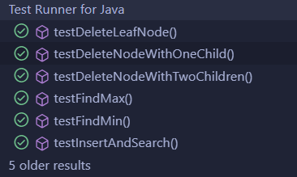

# AREP-Taller7: Taller de árboles binarios

## Descripción del Taller

Este taller consiste en implementar un Árbol de Búsqueda Binaria (BST) en Java, asegurando que sea compatible con la API de Java Collections. El objetivo es crear una estructura de datos eficiente para insertar, eliminar, buscar y organizar valores de forma jerárquica, aprovechando las propiedades del BST.

## Requisitos

* [Git](https://git-scm.com/) - Control de versiones
* [Maven](https://maven.apache.org/) - Manejador de dependencias
* [Java](https://www.oracle.com/java/technologies/downloads/#java17) - Lenguaje de programación

###Instalación

Realice los siguientes pasos para clonar el proyecto en su máquina local.

1. Clonar repositorio.

```bash
git clone https://github.com/RulosS290/AREP.git
```

2. Cambiar de rama.

```bash
git checkout Taller7
```

### Ejecutando las pruebas

* Instalar dependencias
```bash
mvn clean install
```

* Construir el proyecto
```bash
mvn package
```
* Compilar el proyecto
```bash
mvn compile
```
* Ejecutar pruebas
```bash
mvn test
```



### Versiones

Apache Maven 3.9.9

Java 17

### Autores

Daniel Santiago Torres Acosta [https://github.com/RulosS290](https://github.com/RulosS290)

## Agradecimientos

Daniel Benavides - Profesor AREP

Santiago Parra - Monitor
